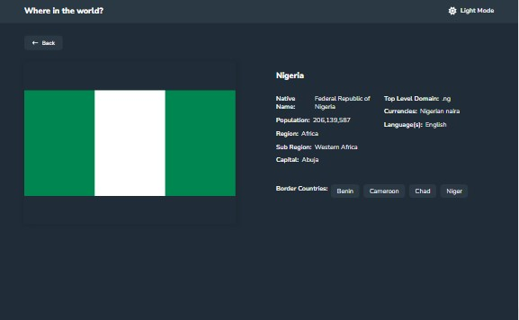

## Table of contents

- [Overview](#overview)
  - [Screenshot](#screenshot)
  - [Links](#links)
- [My process](#my-process)
  - [Built with](#built-with)
  - [What I learned](#what-i-learned)
  - [Continued development](#continued-development)
- [Author](#author)

## Overview

### Screenshot



### Links

- Solution URL: [Add solution URL here](https://your-solution-url.com)
- Live Site URL: [Add live site URL here](https://your-live-site-url.com)

## My process

### Built with

- SCSS
- Flexbox
- CSS Grid
- Laptop-first workflow
- React Transition Group
- [React](https://reactjs.org/) - JS library
- [Next.js](https://nextjs.org/) - React framework

### What I learned

I learnt a lot on new things on next Js like:

- Using getStaticProps and getStaticPaths to pre-render contents from server to browser.
- Page routing
- Integrating backend

```Next.js
export async function getStaticProps() {
  const res = await fetch("https://restcountries.com/v3.1/all");

  if (!res.ok) {
    throw new Error("Something went wrong!");
  }

  const data = await res.json();

  const loadedData = data.map((country) => {
    return {
      name: country.name.common,
      population: country.population,
      region: country.region,
      capital: country.capital
        ? country.capital
        : "This country has no capital",
      flag: country.flags.svg,
    };
  });

  return {
    props: {
      newData: loadedData,
    },
    revalidate: 10,
  };
}

```

### Continued development

- Next js
- React Transition Groups
- UseContext

## Author

- Frontend Mentor - [@ejim11](https://www.frontendmentor.io/profile/ejim11)
- Twitter - [@favourejim56](https://www.twitter.com/favourejim56)
